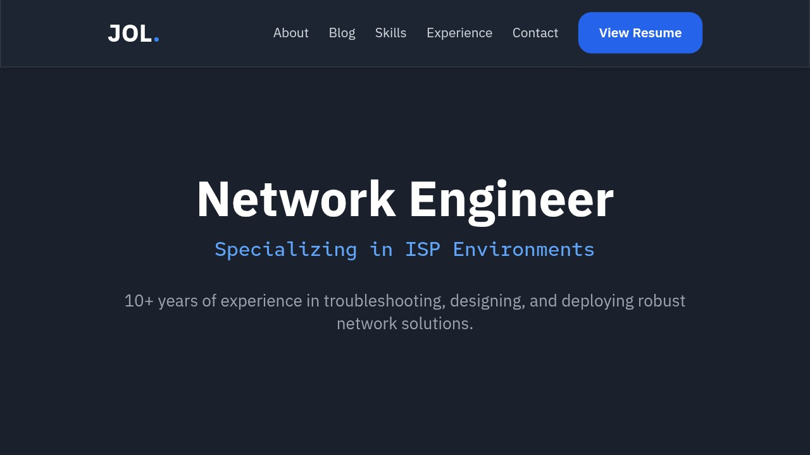

# My Eleventy Project

This is a personal portfolio and blog website built with [Eleventy](https://www.11ty.dev/).



### Built With

*   [Eleventy](https://www.11ty.dev/)
*   [Tailwind CSS](https://tailwindcss.com/)
*   [Express.js](https://expressjs.com/)

## Getting Started

To get a local copy up and running, follow these simple steps.

### Installation

1.  Clone the repo:
    ```sh
    git clone https://github.com/IronicallyJesus/11ty-site.git
    ```
2.  Navigate into the project directory:
    ```sh
    cd 11ty-site
    ```
3.  Install NPM packages:
    ```sh
    npm install
    ```

## Usage

To start the development server with live-reloading:
```sh
npm start
```
Open [http://localhost:8080](http://localhost:8080) to view it in the browser.

To build the site for production:
```sh
npm run build
```
The production-ready files will be in the `_site` directory.